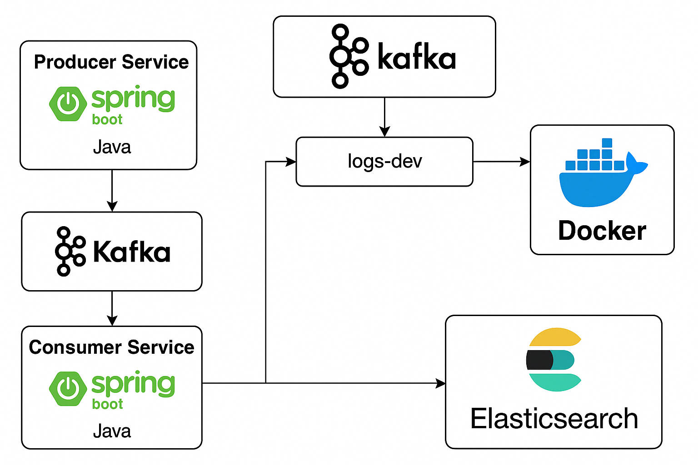

# Real-Time Log Analytics


## 📌 Overview

This project demonstrates a real-time log analytics pipeline using Kafka, Spring Boot, Elasticsearch, and Kibana.

## 📊 Architecture



## 🚀 Stack

- Kafka (via Docker)
- Producer microservice (Spring Boot)
- Consumer microservice (Spring Boot)
- Elasticsearch
- Kibana

## 📦 Modules

- `producer-service`: Simulates microservices logging into Kafka
- `consumer-service`: Consumes and processes Kafka log messages
- `docker-compose.yml`: Local Kafka + Zookeeper setup (optionally with ELK stack)
-

## 📂 Data View

Make sure to create a Kibana data view:

- Name: `logs*`
- Time field: `timestamp`

## 🧪 Testing

```bash
mvn clean verify
```

## 📈 Live Demo

Access the [GitHub Pages demo](https://lguberan.github.io/real-time-log-analytics)

## 📁 Folder Structure

```
real-time-log-analytics/
│
├── producer-service/
├── consumer-service/
├── docker-compose.yml
├── README.md
└── docs/
    ├── architecture.png
    └── index.html
```
